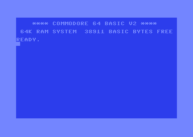
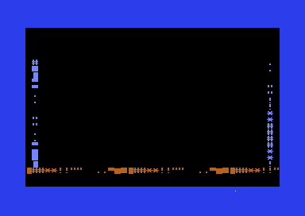
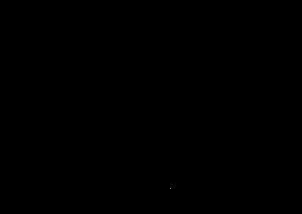
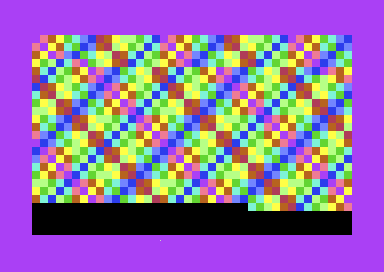
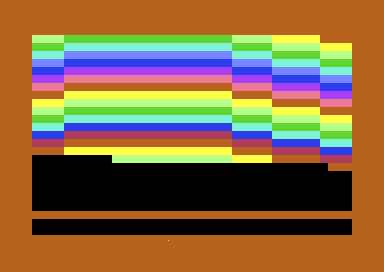
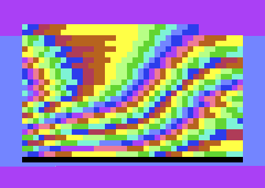
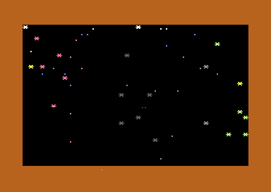
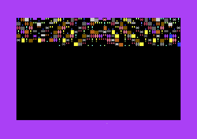

# Effect inventory and VICE capture gallery

The `InitTbl` and `UpdateTbl` dispatch tables in `src/subway.s` define this
inventory. Each part receives three or four complete musical bars, fades from
row 12, and hands off at the next row-0 edge. All output is C64 text mode; the
effects use character/colour geometry rather than bitmap or sprite takeover.

## Dispatch table

| # | Effect | Init / update routine | Visual logic |
| ---: | --- | --- | --- |
| 0 | 3SID pulse field | `ti_init` / `ti_update` | Beat-reactive colour field opening. |
| 1 | Plasma lattice | `pl_init` / `pl_update` | Three independent phases form a scrolling colour plasma. |
| 2 | Hyper star field | `hs_init` / `hs_update` | Moving character stars with depth-like speed/offset changes. |
| 3 | XOR waves | `xr_init` / `xr_update` | Phase-combined wave geometry and cycling palette. |
| 4 | Colour waves | `wv_init` / `wv_update` | Horizontal wave-height table with beat-responsive colours. |
| 5 | Perspective tunnel | `tn_init` / `tn_update` | Forward Z motion, barrel warp, and precomputed row/column perspective. |
| 6 | Sine star field | `ss_init` / `ss_update` | Parallax character stars driven by sine offsets. |
| 7 | Wireframe tunnel | `ts_init` / `ts_update` | Text-mode tunnel with distance, wobble, and zoom pulse. |
| 8 | Heart voyager | `hv_init` / `hv_update` | Animated heart/halo geometry and trail palette. |
| 9 | Multiplex cube | `mc_init` / `mc_update` | Text-mode reinterpretation of multiplexed cube edge timing. |
| 10 | Yaw tunnel | `yw_init` / `yw_update` | Tunnel with auto-yaw, column wobble, and per-cell tint. |
| 11 | Turbo tunnel | `tb_init` / `tb_update` | Faster deterministic zoom/tunnel phase. |
| 12 | Golden heart | `gh_init` / `gh_update` | Sparse heart centre and glowing halo. |
| 13 | Raster grid | `rg_init` / `rg_update` | Raster-safe boot-grid visual language without IRQ takeover. |
| 14 | Cyber grid | `cg_init` / `cg_update` | Beat-driven grid characters and palette animation. |
| 15 | Safe tunnel prime | `sp_init` / `sp_update` | No-self-modifying-code wobble tunnel variant. |
| 16 | Black orbit | `bo_init` / `bo_update` | Dark orbital mask, character field, and colour orbit. |
| 17 | Rotor cube | `rc_init` / `rc_update` | Readable rotating cube edges and connector diagonals. |
| 18 | Solar flare | `PortedInit` / `SolarFlareRender` | Table-driven flare/ray character field. |
| 19 | Prism gate | `PortedInit` / `PrismGateRender` | Colour prism/gate geometry from per-row tables. |
| 20 | Twist lattice | `PortedInit` / `TwistLatticeRender` | Twisting lattice characters and palette phases. |
| 21 | Infinity corridor | `ic_init` / `ic_update` | Repeating inward corridor with a cycling depth phase. |
| 22 | Gold trench | `gt_init` / `gt_update` | Double rails, crossbars, and beat-reactive gold glow. |
| 23 | Cube V3 rotor | `cv_init` / `cv_update` | Two-plane wire cube, depth connectors, and a rotating inner core. |
| 24 | Vortex | `vx_init` / `vx_update` | Vortex distance table and radial colour motion. |
| 25 | Mux edge field | `mb_init` / `mb_update` | Alternating horizontal and vertical edge bands. |
| 26 | Raster boot tunnel | `rb_init` / `rb_update` | Safe horizontal-scroll tunnel/grid treatment. |
| 27 | Neon wire cube | `nw_init` / `nw_update` | Wire-cube atlas rows with neon edge colours. |

## Verified captures

The gallery assets are raw 384×272 PNG screenshots produced by VICE. The first
eight effects below were captured at verified mid-scene points derived from the
three-bar scheduler. The capture naming convention uses the dispatch-table
index. The remaining effects are fully documented above; their exact-timing
captures are intentionally not presented until they can be regenerated rather
than being mislabeled.

